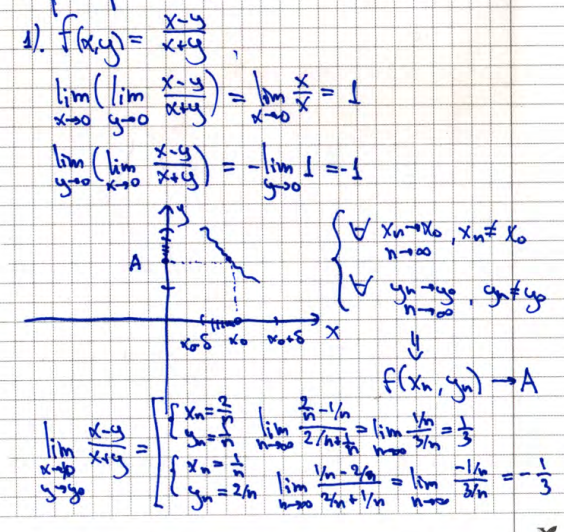
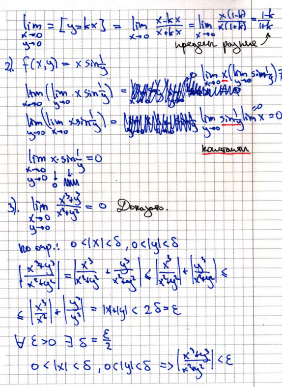

<Badge type="warning">in progress</Badge>
# 4. Повторные и двойные пределы. Теорема о существовании повторного предела (док-во). Примеры

## Двойной предел

$$
\lim_{\substack{x \to x_0 \\ y \to y_0}} f(x,y) = \lim_{P \to P_0} f(P) = A = \text{const}
$$

## Повторный предел

1. $\displaystyle \lim_{x \to x_0} \left( \lim_{y \to y_0} f(x,y) \right)$ - сначала по $y$, потом по $x$
2. $\displaystyle \lim_{y \to y_0} \left( \lim_{x \to x_0} f(x,y) \right)$ - сначала по $x$, потом по $y$

## Теорема о существовании повторного предела

Пусть дана функция двух переменных:  
$$
f(x,y): X \times Y \to \mathbb{R}
$$
и точка $(x_0, y_0)$ - предельная точка множества $E = X \times Y$.

Предположим, что существуют:

1. Двойной предел:  
   $$
   \exists \lim_{\substack{x \to x_0 \\ y \to y_0}} f(x,y) = A
   $$

2. Повторный предел по $x$ при фиксированном $y$:  
   $$
   \exists \lim_{x \to x_0} f(x,y) = \varphi(y)
   $$  
   (т.е. для каждого $y \in Y$, кроме, возможно, $y_0$, существует предел по $x$).

Тогда существует повторный предел по $y$:  
$$
\exists \lim_{y \to y_0} \varphi(y) = A
$$

### Доказательство

По определению двойного предела:  
$$
\exists \lim_{\substack{x \to x_0 \\ y \to y_0}} f(x,y) = A \iff \forall \varepsilon > 0 \ \exists \delta(\varepsilon) > 0 :
\begin{cases}
0 < |x - x_0| < \delta \\
0 < |y - y_0| < \delta
\end{cases}
\Rightarrow |f(x,y) - A| < \varepsilon
$$

Фиксируем $y$. Тогда при $x \to x_0$:  
$$
\lim_{x \to x_0} |f(x,y) - A| = |\varphi(y) - A|
$$

Из неравенства выше следует: $|\varphi(y) - A| < \varepsilon^*,$ где $\varepsilon^* \to 0$ при $\varepsilon \to 0$

А это означает, что:  
$$
\forall \varepsilon > 0 \ \exists \delta(\varepsilon) > 0 \ \forall y \in Y : 0 < |y - y_0| < \delta \Rightarrow |\varphi(y) - A| < \varepsilon
$$

То есть:  
$$
\lim_{y \to y_0} \varphi(y) = A
$$

::: danger ЗАМЕЧАНИЕ
Обратное неверно! Существование повторных пределов не гарантирует существование двойного предела. Например:  
$$
\lim_{x \to 0} \left( \lim_{y \to 0} f(x,y) \right) = f(x_0, y_0), \quad
\lim_{y \to 0} \left( \lim_{x \to 0} f(x,y) \right) = f(x_0, y_0)
$$  
не означает, что
$$
\lim_{\substack{x \to x_0 \\ y \to y_0}} f(x,y) = f(x_0, y_0)
$$  
\- это **дополнительное условие**, которое нужно проверять отдельно.
:::

## Примеры

