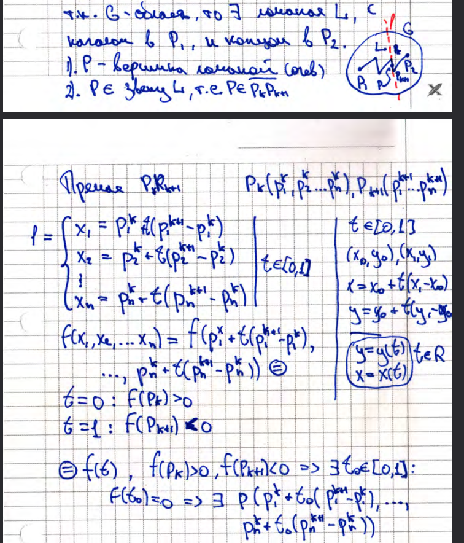

# 6. Связное множество. Область. Теорема Больцано-Коши (док-во)

**_Связное множество_** - это множество, для которого $\forall P_1,P_2\in E$ существует ломаная с началом в $P_1$ и с концом в $P_2$,
содержащаяся в $E$.

**_Область_** - открытое и связное множество

## Теорема Больцано-Коши
$G$ - область, $P_1,P_2\in G$ $f(P_1)>0$, $f(P_2)<0$. ($f: G \subset \mathbb{R}^n \to \mathbb{R}$)  
Тогда $\exists P\in G$: $f(P)=0$

### Доказательство

