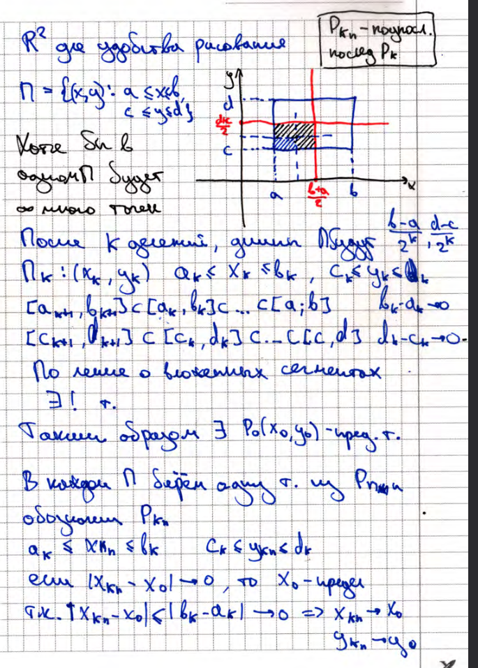

# 7. Теорема Больцано-Вейерштрасса о сходимости подпоследовательности ограниченной последовательности к предельной точке множества (док-во для случая n=2)
Последовательность $\{P_k\}$ - ограничена. Точки $P_k \in \mathbb{R}^n$ (т.е. $\exists$ параллелепипед $\Pi$, 
в котором содержатся все точки $\{P_k\}$). Тогда $\exists$ подпоследовательность $P_{n_k}$,
которая сходится к предельной точке.
### Доказательство
