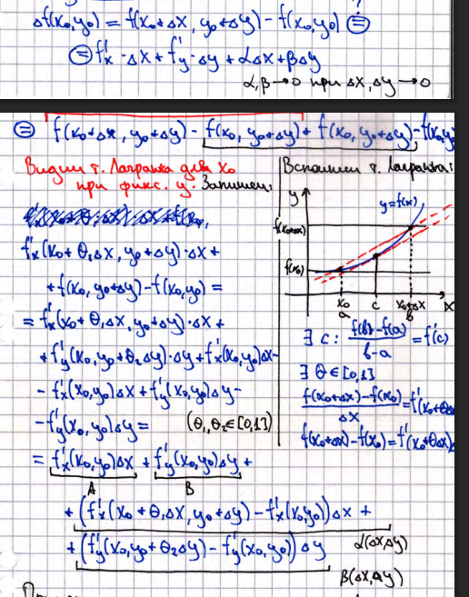
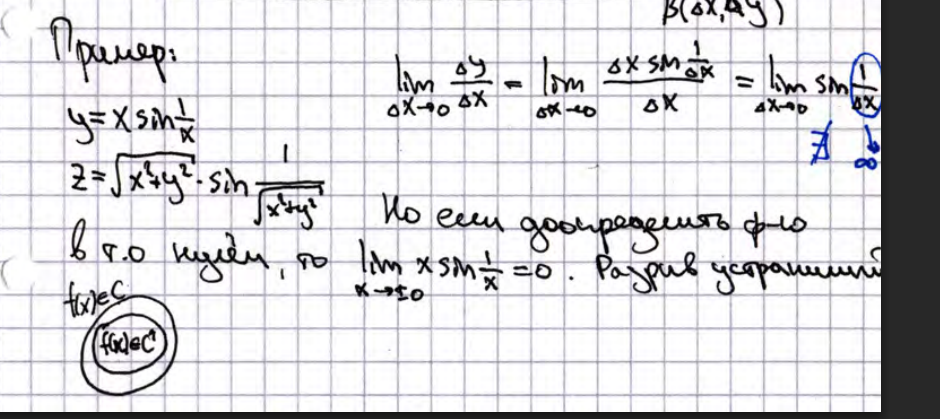

# 10. Дифференцируемость фнп. Достаточное условие дифференцируемости (док-во). Примеры

## Дифференцируемость функции нескольких переменных

Пусть $f(x,y,z)$ определена в окрестности точки $P_0 = (x_0,y_0,z_0)$.  
Функция $f$ называется дифференцируемой в точке $P_0$, если её приращение можно представить в виде:  
$$
\Delta f(P_0) = f(x_0 + \Delta x, y_0 + \Delta y, z_0 + \Delta z) - f(x_0, y_0, z_0) = A \Delta x + B \Delta y + C \Delta z + o(\Delta x) + o(\Delta y) + o(\Delta z)
$$  
при $\Delta x, \Delta y, \Delta z \to 0$.

## Достаточное условие дифференцируемости
Если частные производные $f_x'$ и $f_y'$ существуют и непрерывны в точке $P_0$, то функция $f(x,y)$ дифференцируема в этой точке.

### Доказательство

## Примеры
