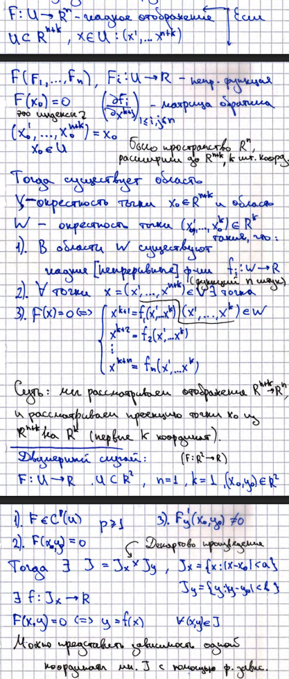

# 16. Неявно заданные функции. Объяснение проблематики. Теорема о неявно заданной функции (формулировка). 

## Проблематика
Не все неявные функции можно выразить явно (например, уравнение окружности). Хочется чтобы можно было. Что делать?

## Теорема о неявно заданной функции

