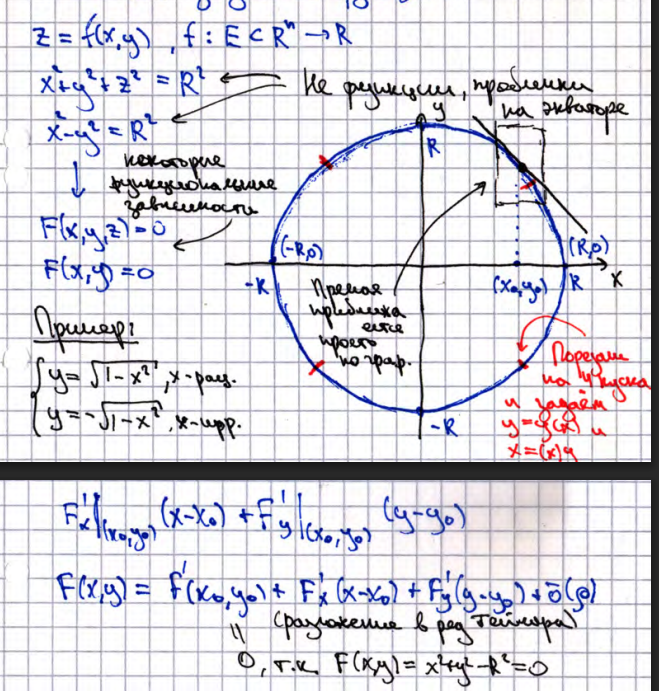
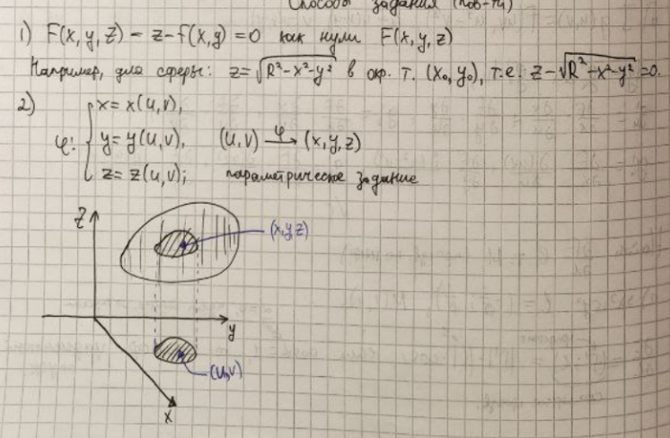

# 17. Поверхности в трехмерном пространстве. Регулярная поверхность. Примеры. Способы задания поверхностей. Неособая точка. Примеры.

## Регулярная поверхность

Множество точек $S \subset \mathbb{R}^3$ называется **_регулярной поверхностью_** (Р.П.), если в окрестности каждой своей точки
его можно представить в виде функции, зависящей от двух переменных (например, $z = f(x,y)$), в соответствующих декартовых координатах.

## Способы задания поверхностей

## Неособая точка
**_Неособая точка_** - такая точка, что градиент от функции, задающей поверхность, в этой точке не обращается в $0$.

### Примеры
Вершина координат у конуса $z^2 = x^2 + y^2$ является особой. Все точки сферы неособые.