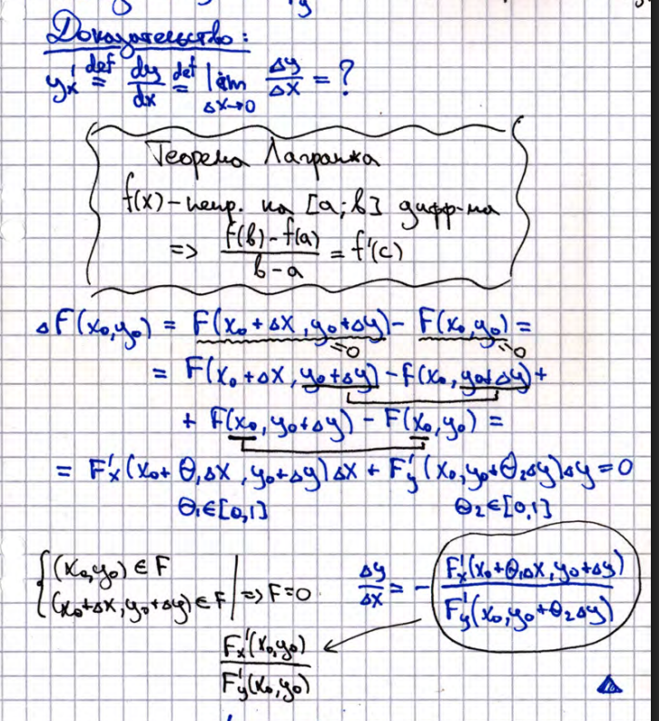

# 18. Теорема о производной неявной функции (общая формулировка+доказательство для случая 2-х переменных)

Пусть задано уравнение $F(x,y) = 0$, и в точке $(x_0, y_0)$ выполняются условия:

1. $F(x_0, y_0) = 0$,
2. $F_y'(x_0, y_0) \ne 0$,
3. $\exists F_x'(x_0, y_0)$ в окрестности точки $(x_0, y_0)$,
4. $F(x,y)$ непрерывна в окрестности точки $(x_0, y_0)$.

Тогда существует функция $y'_x$, такая что:
$$
y'_x = -\frac{F_x'}{F_y'}
$$

### Доказательство

