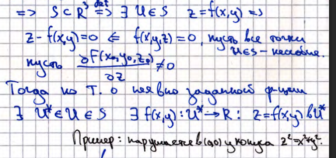
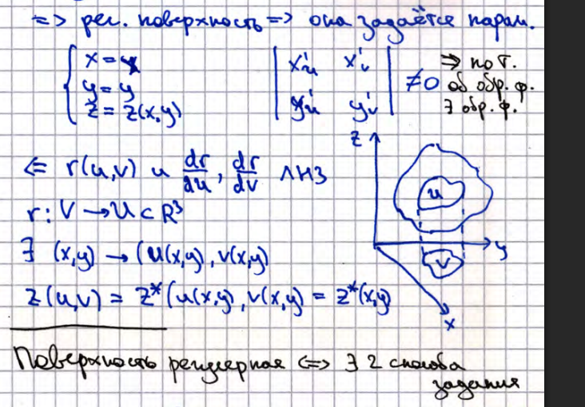

# 19. Регулярные (неособые точки поверхностей). Лемма 1 о регулярной поверхности (док-во). Лемма 2 о регулярной поверхности (док-во). 

**_Неособая точка_** - такая точка, что градиент от функции, задающей поверхность, в этой точке не обращается в $0$.

## Лемма 1
Множество $S \subset \mathbb{R}^3$ образует регулярную поверхность $\Leftrightarrow$ если в каждой своей окрестности 
$\forall U \in S$ оно задаётся нулями, т.е. $F(x,y,z) = 0$

### Доказательство

## Лемма 2
Множество $S \subset \mathbb{R}^3$ образует регулярную поверхность $\Leftrightarrow$ если в каждой своей окрестности $\forall x \in S$ оно задаётся
гладким отображением $\vec{r}$: $\quad \vec{r}: (u,v) \to \big( x(u,v), y(u,v), z(u,v) \big)$ и $\frac{d \vec{r}}{d  u}, \frac{d \vec{r}}{d v}$ линейно независимы

### Доказательство

