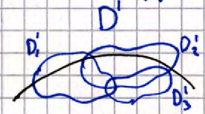

# 20. Касательное пространство. Локальные координаты. Понятие локальной карты и атласа.

**_Касательное пространство_** - это все плоскости $Р$ порождённые для каждой $M_0$ на $\gamma(t)$,
причём пространство двумерное и одинаково для Любой $\gamma(t)$.

**_Локальные координаты_** - пара координат из $U \times V$

**_Локальная карта_** - область $D'$ на поверхности, для которой можно задать локальные координаты

**_Атлас_** - объединение не более чем счетного числа карт