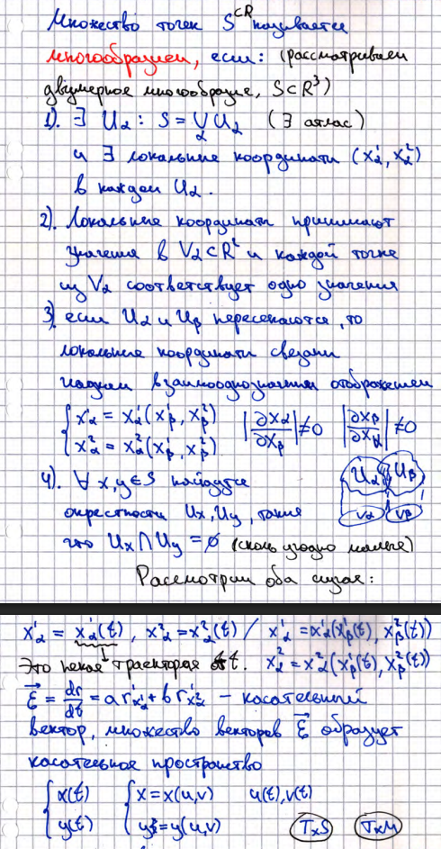

# 21. Поверхности как двумерные многообразия. Гауссова и средняя кривизна. Ориентация поверхности.

**_Многообразие_** - множество точек $S \subset \mathbb{R}^3$, для которых справедливо

## Гауссова кривизна и средняя кривизна

Для поверхности, заданной функцией $z = f(x,y)$, вводятся следующие характеристики:

- **Гауссова кривизна:**
  $$
  K = f_{xx}'' \cdot f_{yy}'' - (f_{xy}'')^2
  $$

- **Средняя кривизна:**
  $$
  H = \frac{1}{2} (f_{xx}'' + f_{yy}'')
  $$

**Интерпретация:**

- Если $K > 0$, то поверхность $z = f(x,y)$ имеет в точке **локальный минимум или максимум**, в зависимости от знака $H$:
    - если $H < 0$ — локальный **максимум**,
    - если $H > 0$ — локальный **минимум**.
    - При этом поверхность в окрестности точки лежит по одну сторону от касательной плоскости.

- Если $K < 0$, то поверхность в окрестности точки лежит по **обе стороны** от касательной плоскости — это седловая точка.

## Ориентация поверхности

Рассмотрим параметризацию поверхности в окрестности точки $P$:

$$
\vec{r}(u,v) = (x(u,v), y(u,v), z(u,v))
$$

Тогда касательные векторы:

$$
\vec{r}_u = \frac{\partial \vec{r}}{\partial u}, \quad \vec{r}_v = \frac{\partial \vec{r}}{\partial v}
$$

образуют **касательную плоскость** в точке $P$. Нормальный вектор:

$$
\vec{n} = \vec{r}_u \times \vec{r}_v
$$

Если мы можем **непрерывно выбирать направление** этого вектора $\vec{n}$ на всей поверхности — поверхность **ориентируема**.

> Например, на сфере - можно выбрать внешнюю нормаль, и она будет непрерывна.  
> На листе Мёбиуса - невозможно: если пройти по ленте, нормаль "перевернётся".