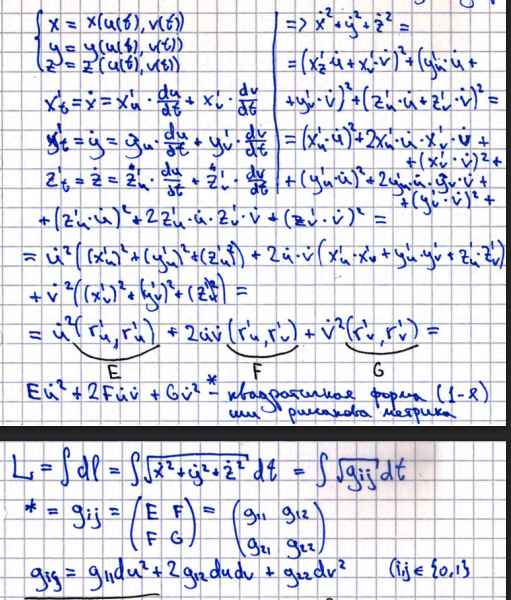

# 22. Длины кривых на поверхности. Вектор скорости. Градиент. Первая квадратичная форма (риманова метрика). Лемма (док-во).	

## Длина кривой
**_Длина кривой_** - супремум всех длин ломанных

## Вектор скорости
$\vec{r}_u'$ и $\vec{r}_v'$ линейно независимы
$$
\vec{\varepsilon} = a \cdot \vec{r}_u' + b \cdot \vec{r}_v'
$$

## Градиент
**_Градиент_** - направление наискорейшего роста, вектор из частных производных

## Первая квадартичная форма

