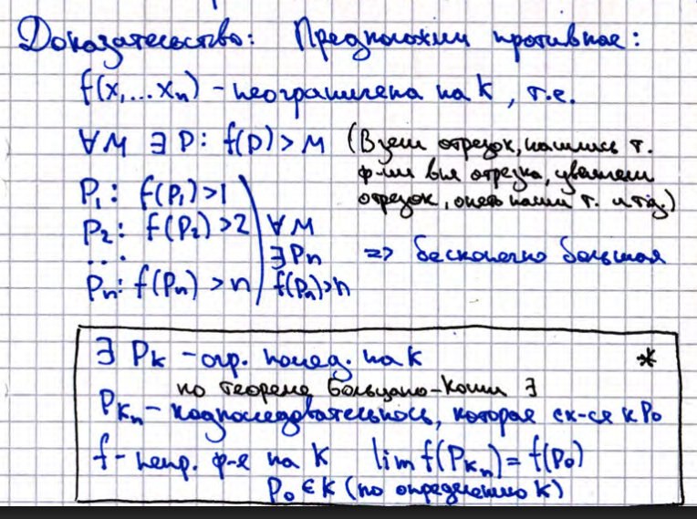
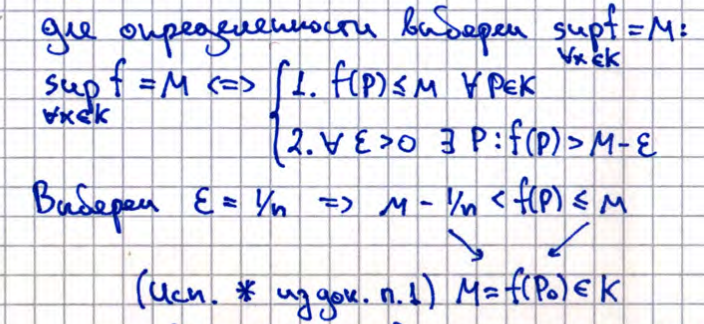

# 25. Первая и вторая теоремы Вейерштрасса о непрерывной функции на компакте.

Пусть $f: K \subset \mathbb{R}^n \to \mathbb{R}$ - непрерывна,
$K$ - ограниченное и замкнутое множество в $\mathbb{R}^n$.

## Теорема I
$f(x_1, \dots, x_n)$ - ограничена на $K$ ($\exists M: \forall P \in K \quad |f(P)| \leq M$)

### Доказательство

## Теорема II

$f(x_1, ... , x_n)$ достигает наименьшего и наибольшего значения на $K$.

### Доказательство
