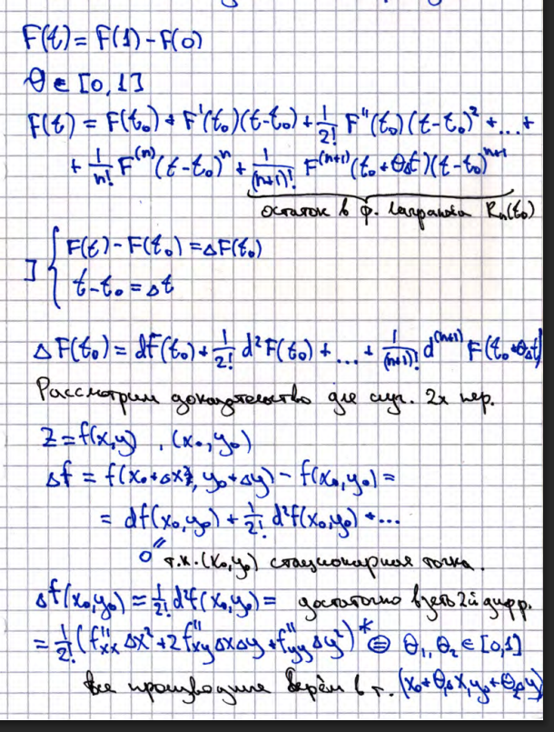
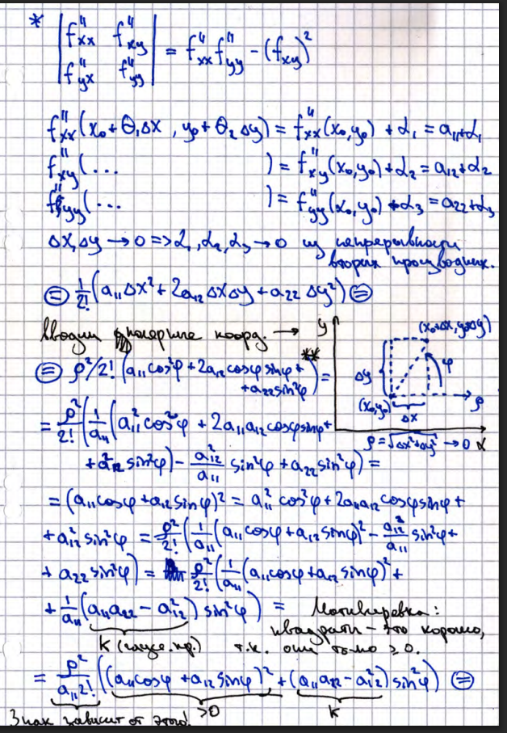
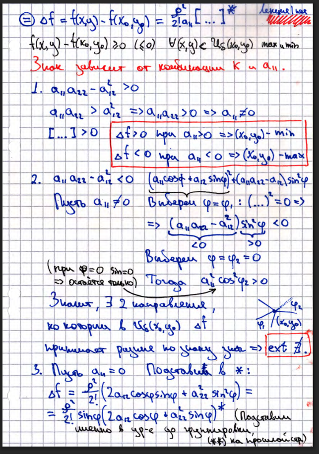
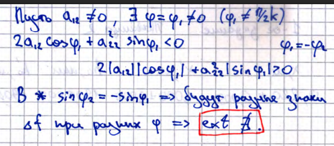

<Badge type="warning">in progress</Badge>
# 26. Знакоопределенные квадратичные формы. Достаточное условие локального экстремума (док-во). 

## Достаточное условие экстремума
Если $K < 0$, то экстремум
### Доказательство

